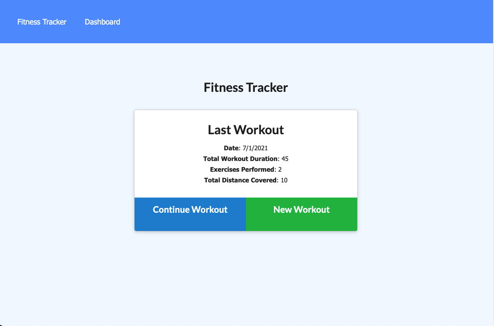

# Workout Tracker

## Description
As a user, I want to be able to view create and track daily workouts. I want to be able to log multiple exercises in a workout on a given day. I should also be able to track the name, type, weight, sets, reps, and duration of exercise. If the exercise is a cardio exercise, I should be able to track my distance traveled.
## Table of Contents
- [Installation](#installation)
- [Usage](#usage)
- [License](#license)
- [Contributing](#contributing)
- [Questions](#questions)
## Installation
To install necessary dependencies, run the following command:
```
npm i
npm run seed
node server.js
```

## Usage
Express, Mongoose, and Morgan are all required to run this application. To begin, run node server.js.

A linked to my deployed page can be found here: [Heroku](https://hidden-dawn-08659.herokuapp.com/).




## License
This project is licensed under the: none.


## Contributing
There were no additional contributors to this project.

## Questions
If you have any questions about the repo, open an issue or contact me directly at boppcaitlin@gmail.com. You can find more of my work at [caitbopp](https://github.com/caitbopp).